# ARCHITECTURE.md

# VoiceText — Application Architecture

**Single Source of Truth for System Design**

| Field | Value |
|-------|-------|
| Version | 1.0.0 |
| Last Updated | 2026-07-16 |
| Scope | Current implementation (v1.0.0) |
| Status | Authoritative |

---

## Table of Contents

1. [Executive Summary](#1-executive-summary)
2. [Architectural Principles](#2-architectural-principles)
3. [System Overview](#3-system-overview)
4. [Complete Folder Structure](#4-complete-folder-structure)
5. [Complete Module Inventory](#5-complete-module-inventory)
6. [Module Responsibilities](#6-module-responsibilities)
7. [Dependency Relationships](#7-dependency-relationships)
8. [Data Flow](#8-data-flow)
9. [UI Architecture](#9-ui-architecture)
10. [Storage Architecture](#10-storage-architecture)
11. [AI Architecture](#11-ai-architecture)
12. [Audio Pipeline](#12-audio-pipeline)
13. [Speech Recognition Pipeline](#13-speech-recognition-pipeline)
14. [PWA Architecture](#14-pwa-architecture)
15. [Service Worker Strategy](#15-service-worker-strategy)
16. [Security Model](#16-security-model)
17. [Error Handling Strategy](#17-error-handling-strategy)
18. [State Management](#18-state-management)
19. [Event Flow](#19-event-flow)
20. [Performance Strategy](#20-performance-strategy)
21. [Future Cloud Evolution](#21-future-cloud-evolution)
22. [Architecture Decision Summary](#22-architecture-decision-summary)
23. [Known Constraints](#23-known-constraints)
24. [Extension Guidelines](#24-extension-guidelines)

---

## 1. Executive Summary

VoiceText is a client-side web application that converts Amharic speech to text using the Web Speech API. It runs entirely in the browser with no backend server. All data is stored locally via IndexedDB and localStorage. The application is installable as a Progressive Web App with offline support for the application shell.

### Key Characteristics

- **Zero server dependency** — no backend, no database, no APIs (except Web Speech API and optional AI providers)
- **22 JavaScript modules** organized in a flat hierarchy (except `ai/` subdirectory)
- **~4,200 lines** of application JavaScript
- **Factory + IIFE singleton** module pattern — no build tools, no frameworks
- **Cache-first PWA** with service worker for offline app shell
- **Pluggable AI architecture** supporting OpenAI, Anthropic, and local providers

### What This Document Covers

This document describes the **actual implemented architecture** — not aspirational or future designs. Every module, dependency, and data flow described here exists in the current codebase.

---

## 2. Architectural Principles

| Principle | Application |
|-----------|-------------|
| **Client-side first** | All processing happens in the browser. No backend required. |
| **Offline-friendly** | Application shell cached by service worker. Core UI works without network. |
| **Modular decomposition** | Each concern in its own file. app.js orchestrates, never implements. |
| **Dependency injection** | Modules receive configuration via `init(config)`, not global lookups. |
| **No build tools** | Static HTML/CSS/JS. Deploy by copying files. |
| **Progressive enhancement** | Web Speech API required for transcription; everything else degrades gracefully. |
| **Security by default** | API keys in sessionStorage. No secrets in source. Sanitized error messages. |
| **Single responsibility** | Each module does one thing. HistoryManager manages data, HistoryUI manages display. |
| **Convention over configuration** | IIFE singletons with `init(config)` → `public API` pattern throughout. |
| **Privacy by design** | No analytics, no tracking, no cookies. Transcripts never leave the device. |

---

## 3. System Overview

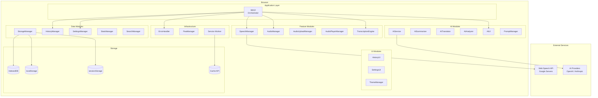

### Layer Responsibilities

| Layer | Modules | Responsibility |
|-------|---------|----------------|
| **Orchestration** | app.js | Event binding, module initialization, UI coordination |
| **Features** | SpeechManager, AudioManager, AudioUploadManager, AudioPlayerManager, TranscriptionEngine | Core domain logic |
| **Data** | StorageManager, HistoryManager, SettingsManager, StatsManager, SearchManager | Persistence and data operations |
| **UI** | HistoryUI, SettingsUI, ThemeManager, AIUI | DOM manipulation, user interaction |
| **AI** | AIService, AISummarizer, AITranslator, AIAnalyzer, PromptManager | AI provider abstraction |
| **Infrastructure** | ErrorHandler, PwaManager, Service Worker | Cross-cutting concerns |

---

## 4. Complete Folder Structure

```
src/amh/                              # Application root
├── index.html                        # Single-page application (470 lines)
├── manifest.json                     # PWA web app manifest
├── service-worker.js                 # App shell caching (115 lines)
│
├── css/
│   └── styles.css                    # Design system (2,241 lines)
│
├── js/                               # Core modules (16 files)
│   ├── app.js                        # Orchestrator (726 lines)
│   ├── storage.js                    # IndexedDB + localStorage + sessionStorage (456 lines)
│   ├── speech.js                     # Web Speech API (248 lines)
│   ├── error-handler.js              # Centralized error handling (224 lines)
│   ├── audio-upload.js               # File upload and validation (216 lines)
│   ├── audio-player.js               # Audio playback controls (216 lines)
│   ├── audio.js                      # Web Audio API visualization (168 lines)
│   ├── settings.js                   # User preferences (163 lines)
│   ├── history.js                    # Transcript collection (154 lines)
│   ├── history-ui.js                 # History panel UI (183 lines)
│   ├── search.js                     # In-text search (127 lines)
│   ├── transcription-engine.js       # Unified mic/file transcription (109 lines)
│   ├── settings-ui.js                # Settings modal UI (111 lines)
│   ├── stats.js                      # Statistics utilities (54 lines)
│   ├── theme.js                      # Theme switching (49 lines)
│   └── pwa.js                        # PWA lifecycle (74 lines)
│
├── js/ai/                            # AI modules (5 files)
│   ├── ai-service.js                 # Provider abstraction layer (309 lines)
│   ├── ai-ui.js                      # AI interface management (280 lines)
│   ├── translator.js                 # Language translation (95 lines)
│   ├── analyzer.js                   # Transcript analysis (92 lines)
│   └── summarizer.js                 # Transcript summarization (67 lines)
│
├── prompts/
│   └── prompts.js                    # Prompt templates (114 lines)
│
└── assets/
    ├── favicon.png                   # Browser tab icon
    ├── mikeintosh_systems_sm.png     # Brand logo
    ├── mic-animate.gif               # Microphone animation
    └── icons/
        ├── icon-192x192.png          # PWA icon (small)
        ├── icon-512x512.png          # PWA icon (large)
        └── icon-maskable-512x512.png # PWA icon (maskable)
```

---

## 5. Complete Module Inventory

| # | Module | File | Lines | Type | Global Name |
|---|--------|------|-------|------|-------------|
| 1 | App Coordinator | `js/app.js` | 726 | IIFE (anonymous) | *(none — private)* |
| 2 | Storage Manager | `js/storage.js` | 456 | IIFE singleton | `StorageManager` |
| 3 | Speech Manager | `js/speech.js` | 248 | IIFE singleton | `SpeechManager` |
| 4 | Error Handler | `js/error-handler.js` | 224 | IIFE singleton | `ErrorHandler` |
| 5 | Audio Upload | `js/audio-upload.js` | 216 | IIFE singleton | `AudioUploadManager` |
| 6 | Audio Player | `js/audio-player.js` | 216 | IIFE singleton | `AudioPlayerManager` |
| 7 | Audio Manager | `js/audio.js` | 168 | IIFE singleton | `AudioManager` |
| 8 | Settings Manager | `js/settings.js` | 163 | IIFE singleton | `SettingsManager` |
| 9 | History Manager | `js/history.js` | 154 | IIFE singleton | `HistoryManager` |
| 10 | History UI | `js/history-ui.js` | 183 | IIFE singleton | `HistoryUI` |
| 11 | Search Manager | `js/search.js` | 127 | IIFE singleton | `SearchManager` |
| 12 | Transcription Engine | `js/transcription-engine.js` | 109 | IIFE singleton | `TranscriptionEngine` |
| 13 | Settings UI | `js/settings-ui.js` | 111 | IIFE singleton | `SettingsUI` |
| 14 | Stats Manager | `js/stats.js` | 54 | IIFE singleton | `StatsManager` |
| 15 | Theme Manager | `js/theme.js` | 49 | IIFE singleton | `ThemeManager` |
| 16 | PWA Manager | `js/pwa.js` | 74 | IIFE singleton | `PwaManager` |
| 17 | AI Service | `js/ai/ai-service.js` | 309 | Factory | `AIService` |
| 18 | AI UI | `js/ai/ai-ui.js` | 280 | IIFE singleton | `AIUI` |
| 19 | AI Translator | `js/ai/translator.js` | 95 | Factory | `AITranslator` |
| 20 | AI Analyzer | `js/ai/analyzer.js` | 92 | Factory | `AIAnalyzer` |
| 21 | AI Summarizer | `js/ai/summarizer.js` | 67 | Factory | `AISummarizer` |
| 22 | Prompt Manager | `prompts/prompts.js` | 114 | IIFE singleton | `PromptManager` |
| 23 | Service Worker | `service-worker.js` | 115 | SW script | *(N/A — self scope)* |

**Total: 23 files, ~4,309 lines of JavaScript**

---

## 6. Module Responsibilities

### 6.1 Orchestration Layer

#### app.js — Application Coordinator

The central orchestrator. Binds DOM events, initializes all modules, and coordinates inter-module communication. Contains no business logic — it delegates everything to specialized modules.

**Public API:** None (anonymous IIFE, all functions private).

**Key internal functions:**
- `init()` — Bootstraps the entire application
- `initApp()` — Initializes core modules (search, speech, events, history)
- `initAIFeatures()` — Creates AI service instances and wires AI UI
- `bindEvents()` — Registers all DOM event listeners
- `refreshAIServices()` — Reconfigures AI when API key changes
- `setAIApiKey()` — Stores API key and reinitializes AI
- `loadTranscription()` — Loads last transcript from storage
- `updateWordCount()` — Computes and displays statistics
- `cleanup()` — Tears down resources on page unload

### 6.2 Feature Modules

#### SpeechManager — Web Speech API Integration

Manages the browser's `SpeechRecognition` instance. Handles start/stop, result processing, error recovery, and transient error auto-retry.

**Key behaviors:**
- Continuous recognition with interim results
- Auto-retry on transient network/aborted errors (max 2 retries)
- Timer management for recording duration
- Mic permission pre-check via `navigator.permissions`

#### AudioManager — Web Audio Visualization

Creates and manages an `AudioContext` for real-time microphone visualization. Draws frequency data on a canvas element.

**Key behaviors:**
- AudioContext created once in `init()`, reused across start/stop cycles
- Only destroyed on `destroy()` (page cleanup)
- Frequency data drawn via `requestAnimationFrame` loop

#### AudioUploadManager — File Upload Handling

Manages drag-and-drop and file picker audio uploads. Validates file type and size. Extracts metadata (duration, format, size) using a temporary `<audio>` element.

**Key behaviors:**
- Supported formats: MP3, WAV, M4A, OGG, WebM, FLAC, AAC
- Max file size: 100 MB
- Object URL lifecycle: created on load, revoked on clear
- Stale callback guards prevent updates after clear

#### AudioPlayerManager — Audio Playback Controls

Provides play/pause/stop, seek, speed adjustment, and volume/mute controls for uploaded audio files.

**Key behaviors:**
- Uses HTML5 `<audio>` element
- Progress updates via `requestAnimationFrame`
- Speed options: 0.5x, 0.75x, 1x, 1.25x, 1.5x, 2x
- LoadId guard prevents stale callbacks

#### TranscriptionEngine — Unified Transcription Interface

Abstracts the difference between microphone and file transcription. Provides a single `start(mode)` / `stop()` interface regardless of input source.

**Key behaviors:**
- Stores references to SpeechManager and AudioPlayerManager at init (no hardcoded globals)
- `resetOnError()` for error recovery
- File mode: plays audio through player, feeds output to speech recognition
- Clears trailing timer on stop

### 6.3 Data Modules

#### StorageManager — Persistence Layer

Manages all data persistence across three browser storage mechanisms.

**Storage targets:**
| Store | API | Purpose | Persistence |
|-------|-----|---------|-------------|
| IndexedDB | `amharic-voice-to-text` database | Transcript CRUD | Permanent |
| localStorage | `amharic_transcription`, `amharic_transcript_title`, `amharic_theme`, `amharic_settings`, `amvtt_migrated` | Preferences, legacy data | Permanent |
| sessionStorage | `aiApiKey` | API keys | Session only (tab close = cleared) |

**IndexedDB schema:**
- Database: `amharic-voice-to-text` (version 1)
- Object store: `transcripts`
- Indexes: `createdAt`, `updatedAt`, `title`

**Migration:** One-way migration from localStorage to IndexedDB. After verification, sets `amvtt_migrated = true`.

#### HistoryManager — Transcript Collection

In-memory cache of transcript metadata backed by StorageManager. Provides CRUD operations and maintains sort order by `updatedAt`.

**Cache behavior:**
- Max cache size: 50 entries (with eviction)
- Sorted by `updatedAt` descending (most recent first)
- `setCurrent(id)` tracks the active transcript

#### SettingsManager — User Preferences

Manages application settings with schema validation and change notification.

**Schema keys:**
| Key | Default | Values |
|-----|---------|--------|
| `theme` | `'dark'` | `'dark'`, `'light'` |
| `speechLanguage` | `'am-ET'` | `'am-ET'` |
| `autoSave` | `true` | `true`, `false` |
| `aiProvider` | `''` | `'openai'`, `'anthropic'`, `'local'` |
| `aiModel` | `''` | Provider-specific model strings |
| `aiEnabled` | `false` | `true`, `false` |

#### StatsManager — Statistics Utilities

Pure utility module. No state, no initialization. Provides word counting, reading time calculation, and duration formatting.

#### SearchManager — In-Text Search

Provides text search within the transcript textarea with match counting and prev/next navigation. Debounced input handler (150ms).

### 6.4 UI Modules

#### HistoryUI — History Panel

Renders the history sidebar panel. Manages list items, empty states, open/delete interactions, and panel toggle animation.

**Key behaviors:**
- Dynamic DOM creation for list items
- `window.confirm()` for delete confirmation
- Error toast on failed deletion
- Escape key closes panel

#### SettingsUI — Settings Modal

Renders the settings modal. Manages form controls for theme, language, auto-save, and AI configuration.

**Key behaviors:**
- Syncs form state with SettingsManager on open
- Theme changes apply immediately via ThemeManager
- Escape key closes modal

#### ThemeManager — Theme Switching

Manages dark/light theme. Sets `data-theme` attribute on `<html>`. Respects `prefers-color-scheme` media query for initial theme.

### 6.5 AI Modules

#### AIService — Provider Abstraction

Factory pattern. `AIService.create(config)` returns an instance bound to a specific provider. Supports OpenAI, Anthropic, and local (Ollama) backends.

**Provider adapters:**
| Provider | Endpoint | Auth Header |
|----------|----------|-------------|
| OpenAI | `api.openai.com/v1/chat/completions` | `Authorization: Bearer` |
| Anthropic | `api.anthropic.com/v1/messages` | `x-api-key` |
| Local | `localhost:11434/api/chat` | None |

**Instance methods:** `complete(prompt, options)`, `updateConfig()`, `getConfig()`, `getState()`, `isBusy()`, `healthCheck()`

**Retry logic:** Up to 2 retries with exponential backoff on 5xx errors.

#### AISummarizer — Transcript Summarization

Wraps AIService with summarization prompts. Variants: `short`, `detailed`, `meeting`.

#### AITranslator — Language Translation

Wraps AIService with translation prompts. Supported languages: Amharic, English, Oromo, Tigrinya, Arabic, French.

#### AIAnalyzer — Transcript Analysis

Wraps AIService with analysis prompts. Types: `keyPoints`, `keywords`, `sentiment`.

#### AIUI — AI Interface Management

Manages all AI-related DOM elements: action buttons, status indicators, result display, apply/copy/dismiss workflow.

#### PromptManager — Prompt Templates

Centralized prompt template system. Templates are functions returning `{ system, user }` objects. No hardcoded prompts in business logic modules.

**Template categories:** `summarize`, `translate`, `analyze`, `improveText`

### 6.6 Infrastructure

#### ErrorHandler — Centralized Error Handling

Categorizes errors (permission, browser, storage, ai, network, file, speech), provides sanitized logging, and returns user-facing messages.

**Key methods:** `handle(category, code, context)`, `report()`, `handleError()`, `getUserMessage()`, `getLog()`

#### PwaManager — PWA Lifecycle

Registers service worker, manages offline/update banners, handles `skipWaiting` for updates.

### 6.7 Service Worker

#### service-worker.js — App Shell Caching

Cache-first strategy for 40+ static assets. Network-only for everything else (including Web Speech API requests).

**Cache:** `amvtt-shell-v4`  
**Strategy:** Cache-first for app shell, network-only for dynamic requests  
**Update:** `skipWaiting` via message from PwaManager

---

## 7. Dependency Relationships

### 7.1 Module Dependency Graph

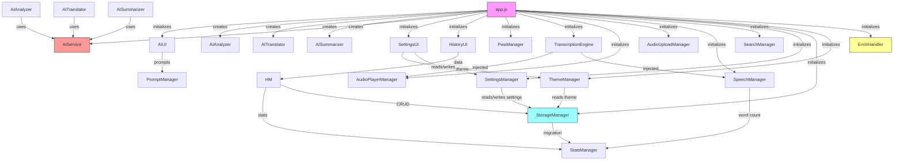

### 7.2 Explicit Dependencies (by module)

| Module | Depends On |
|--------|-----------|
| app.js | All 21 modules + PromptManager |
| StorageManager | StatsManager (migration only) |
| HistoryManager | StorageManager, StatsManager |
| HistoryUI | HistoryManager |
| SettingsManager | StorageManager |
| SettingsUI | SettingsManager, ThemeManager |
| ThemeManager | StorageManager |
| SpeechManager | StatsManager |
| TranscriptionEngine | SpeechManager (injected), AudioPlayerManager (injected) |
| AISummarizer | AIService (instance), PromptManager (optional) |
| AITranslator | AIService (instance), PromptManager (optional) |
| AIAnalyzer | AIService (instance), PromptManager (optional) |
| AIUI | PromptManager |
| All other modules | *(no inter-module dependencies)* |

### 7.3 Dependency Rules

1. **app.js is the only module that imports all others.** No module imports app.js.
2. **Data modules never import UI modules.** StorageManager knows nothing about HistoryUI.
3. **UI modules never import other UI modules.** HistoryUI and SettingsUI are independent.
4. **AI capability modules never import UI modules.** AISummarizer knows nothing about AIUI.
5. **TranscriptionEngine receives dependencies via injection**, not global lookup.

---

## 8. Data Flow

### 8.1 Live Transcription Flow

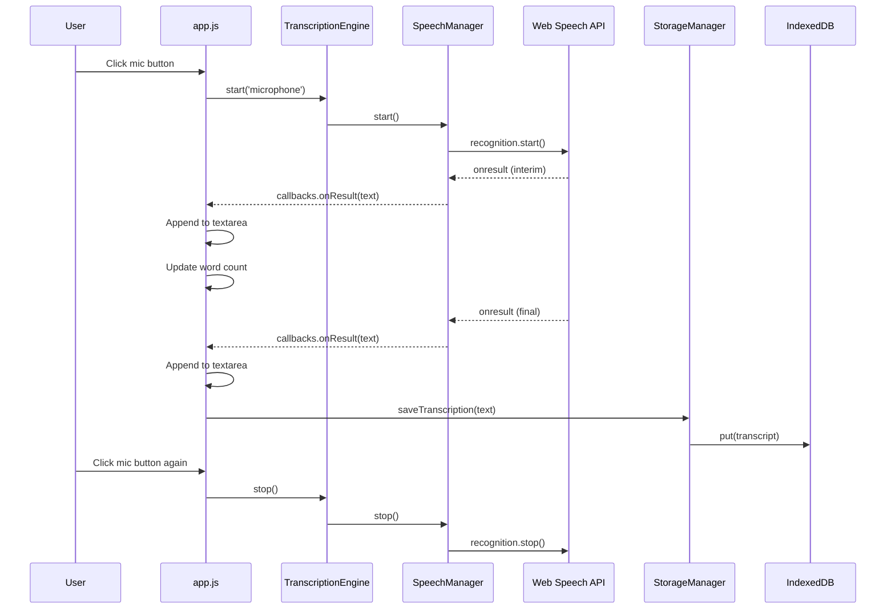

### 8.2 File Transcription Flow

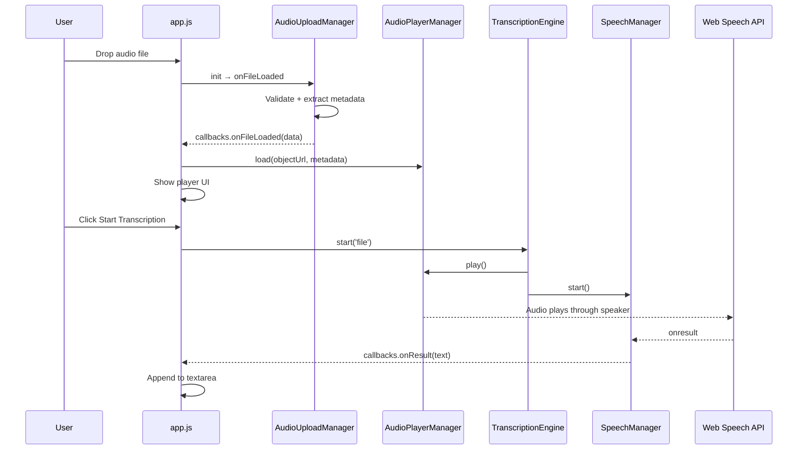

### 8.3 AI Processing Flow

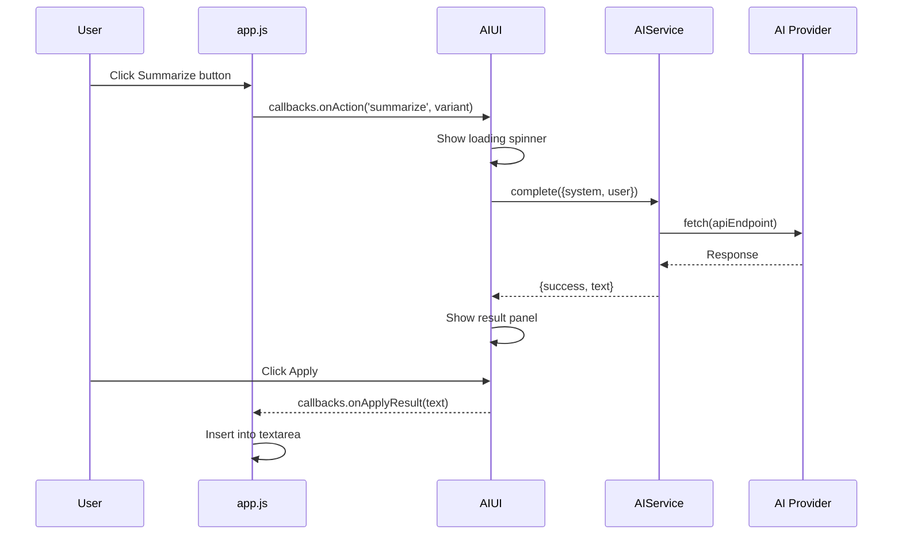

---

## 9. UI Architecture

### 9.1 Layout Structure

```mermaid
graph TB
    subgraph "Page Layout"
        HEADER[App Header<br/>Logo + Title + Theme Toggle]
        TABS[Tab Bar<br/>Record | Upload | AI Assistant]
        
        subgraph "Tab: Record"
            DASH[Dashboard Header<br/>History + Settings buttons]
            MIC[Mic Button<br/>with animated indicator]
            VIS[Audio Visualizer<br/>canvas element]
            TIMER[Recording Timer<br/>HH:MM:SS]
            STATUS[Status Messages]
        end

        subgraph "Tab: Upload"
            DROP[Drop Zone<br/>drag-and-drop area]
            INFO[File Info<br/>name, format, size, duration]
            PLAYER[Audio Player<br/>play/pause/stop/seek/speed/volume]
        end

        subgraph "Tab: AI Assistant"
            BADGE[Provider Badge]
            ACTIONS[AI Action Buttons]
            AISTATUS[AI Status]
            AIRESULT[AI Result Panel]
        end

        subgraph "Transcript Workspace"
            TITLE[Transcript Title<br/>editable input]
            SEARCH[Search Bar<br/>with prev/next/clear]
            OUTPUT[Transcript Output<br/>textarea]
            STATS[Word Count | Characters | Reading Time]
            EXPORT[Export Buttons<br/>copy/print/download/share]
            NEWBTN[New | Reset buttons]
        end

        FOOTER[Footer<br/>Social links + Version]
    end

    subgraph "Overlays"
        HPANEL[History Panel<br/>slide-in sidebar]
        SMODAL[Settings Modal<br/>centered dialog]
        TOAST[Toast Container<br/>notification area]
    end

    HEADER --> TABS
    TABS --> DASH
    TABS --> DROP
    TABS --> BADGE
    DASH --> MIC
    DASH --> VIS
    DASH --> TIMER
    MIC --> OUTPUT
    DROP --> PLAYER
    BADGE --> ACTIONS
    OUTPUT --> STATS
    OUTPUT --> EXPORT
```

### 9.2 Design System

The CSS design system (`styles.css`, 2,241 lines) provides:

- **CSS custom properties** for all colors, spacing, typography, shadows, and transitions
- **Glass-morphism** panels and cards with `backdrop-filter: blur()`
- **Dark/light theme** via `[data-theme]` attribute on `<html>`
- **Responsive breakpoints** at 640px, 768px, 1024px
- **Animation system** for mic pulse, recording indicator, panel slide, modal fade
- **Print styles** that hide UI controls and format transcript for paper

### 9.3 Tab System

Three content tabs controlled by `data-tab` attributes:
- **Record** — Live microphone transcription
- **Upload** — Audio file upload and transcription
- **AI Assistant** — AI-powered transcript analysis

Tab switching managed by app.js via CSS class toggling.

---

## 10. Storage Architecture

### 10.1 Storage Mechanisms

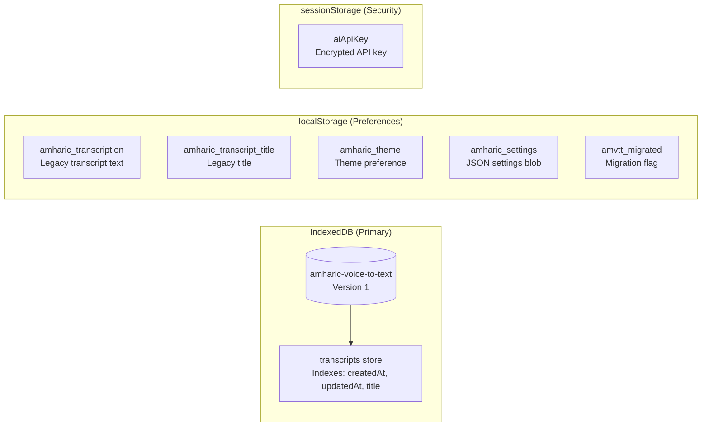

### 10.2 Data Lifecycle

| Data | Created | Read | Updated | Deleted |
|------|---------|------|---------|---------|
| Transcript | `HistoryManager.create()` | `HistoryManager.get()` | `HistoryManager.update()` | `HistoryManager.remove()` |
| Settings | `SettingsManager.reset()` | `SettingsManager.get()` | `SettingsManager.set()` | `SettingsManager.reset()` |
| Theme | `ThemeManager.init()` | `ThemeManager.getCurrent()` | `ThemeManager.setTheme()` | N/A |
| API Key | `setAIApiKey()` | `refreshAIServices()` | `setAIApiKey()` | Tab close |

### 10.3 Migration Strategy

One-way migration from legacy localStorage to IndexedDB:

1. Check `amvtt_migrated` flag
2. If not set, read `amharic_transcription` and `amharic_transcript_title`
3. If data exists, create IndexedDB transcript record
4. Set `amvtt_migrated = true`
5. Legacy localStorage keys are **never deleted** (safety)

---

## 11. AI Architecture

### 11.1 Provider Abstraction

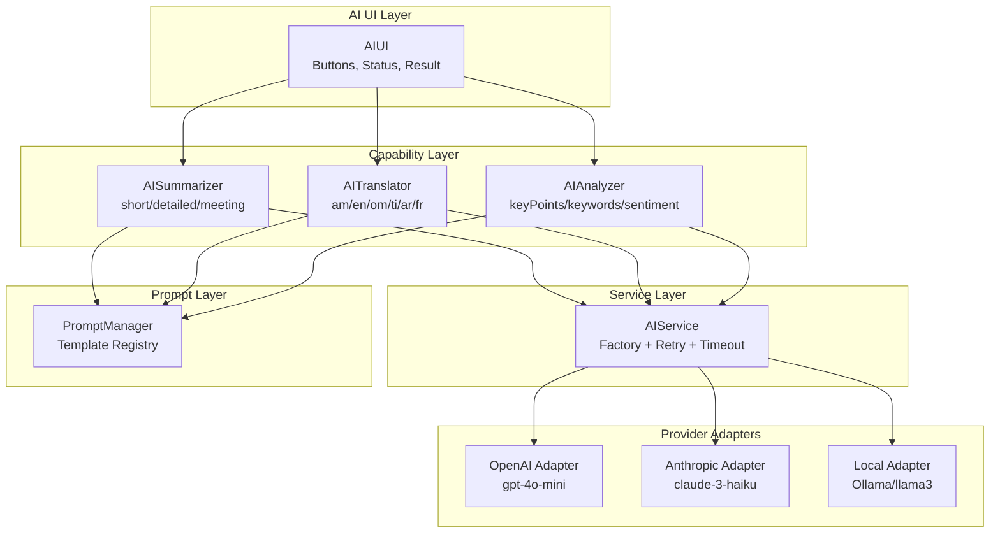

### 11.2 Prompt System

Prompts are centralized in `PromptManager`. Each template is a function that receives context (transcript text, language, etc.) and returns `{ system, user }` strings.

**Template registry:**
| Category | Variant | Purpose |
|----------|---------|---------|
| `summarize` | `short` | Brief summary (2-3 sentences) |
| `summarize` | `detailed` | Comprehensive summary with sections |
| `summarize` | `meeting` | Meeting-style summary with action items |
| `translate` | *(default)* | Language translation |
| `analyze` | `keyPoints` | Extract key points |
| `analyze` | `keywords` | Extract keywords |
| `analyze` | `sentiment` | Sentiment analysis |
| `improveText` | *(default)* | Text improvement and grammar |

### 11.3 Request Lifecycle

1. User clicks action button → AIUI receives click
2. AIUI calls `PromptManager.build(category, variant, context)`
3. AIUI calls `aiService.complete({ system, user })`
4. AIService builds HTTP request via provider adapter
5. AIService executes `fetchWithTimeout()` (30s default)
6. On success: provider adapter parses response, returns `{ success, text }`
7. On failure: error classified, retries attempted (max 2), user-friendly message returned
8. AIUI displays result or error toast

---

## 12. Audio Pipeline

### 12.1 Microphone Input

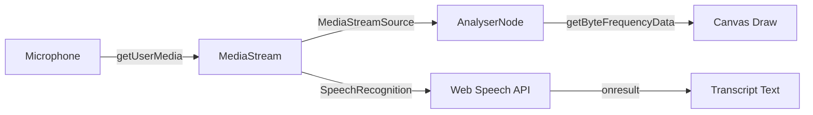

**AudioContext lifecycle:**
- Created once in `AudioManager.init()`
- Resumed on `AudioManager.start()` (handles browser autoplay policy)
- Only closed on `AudioManager.destroy()` (page unload)
- No recreation on start/stop cycles

### 12.2 File Input

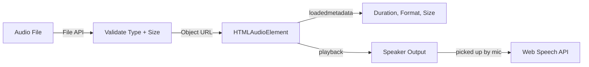

**File validation:**
- Accepted: MP3, WAV, M4A, OGG, WebM, FLAC, AAC
- Max size: 100 MB
- Duration extracted via temporary `<audio>` element with `loadedmetadata` event

---

## 13. Speech Recognition Pipeline

### 13.1 Web Speech API Configuration

```javascript
recognition.continuous = true;        // Don't stop after first result
recognition.interimResults = true;    // Show partial results
recognition.lang = 'am-ET';          // Amharic (Ethiopia)
```

### 13.2 Recognition Lifecycle

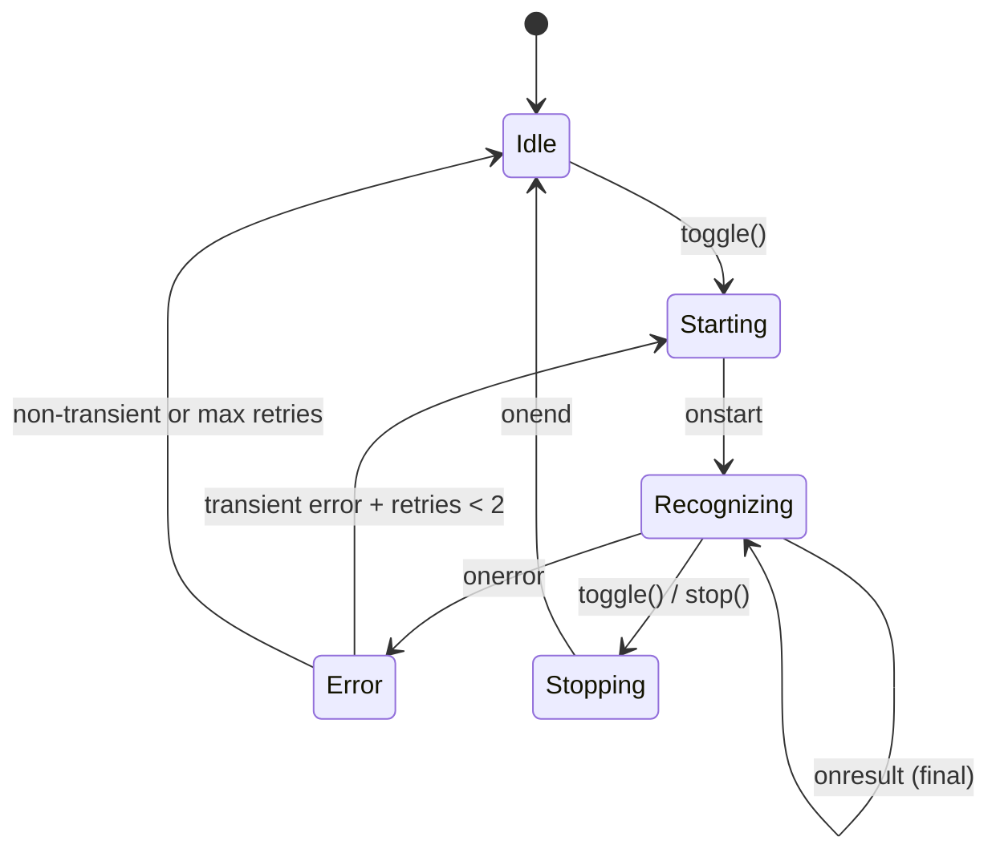

### 13.3 Error Handling

| Error Type | Auto-Retry | User Message |
|-----------|------------|--------------|
| `network` | Yes (max 2) | "Network error. Retrying..." |
| `aborted` | Yes (max 2) | "Recognition interrupted. Retrying..." |
| `no-speech` | No | "No speech detected. Please try again." |
| `audio-capture` | No | "Microphone not available." |
| `not-allowed` | No | "Microphone access denied." |
| `service-not-allowed` | No | "Speech service unavailable." |
| `bad-grammar` | No | "Recognition error. Please try again." |

---

## 14. PWA Architecture

### 14.1 PWA Components

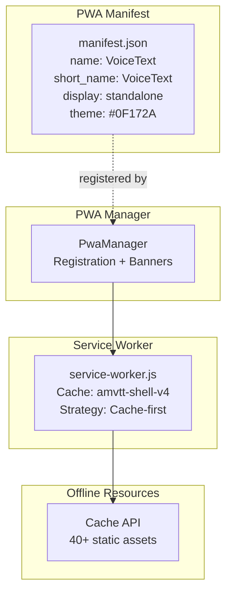

### 14.2 Installability

The application meets PWA installability criteria:
- ✅ Web app manifest with `start_url`
- ✅ Service worker registered
- ✅ HTTPS (required for deployment)
- ✅ Icons (192x192, 512x512, maskable)
- ✅ Standalone display mode

### 14.3 Update Flow

1. New service worker detected (SW installed in background)
2. PwaManager shows update banner
3. User clicks "Refresh"
4. PwaManager sends `skipWaiting` message to SW
5. New SW activates, claims all clients
6. Page reloads with new cached assets

---

## 15. Service Worker Strategy

### 15.1 Cache-First for App Shell

All static assets listed in `APP_SHELL` array are served from cache first. If not cached, fetched from network and cached for next time.

**Cached assets (40+):**
- `index.html`, `manifest.json`
- `css/styles.css`
- All 22 JS modules + prompts.js
- All static assets (icons, images)
- `service-worker.js` itself

### 15.2 Network-Only for Dynamic Requests

Everything NOT in `APP_SHELL` goes to network. This includes:
- Web Speech API requests (to Google servers)
- AI provider API calls
- External resources (fonts, CDN)

### 15.3 Cache Versioning

When `CACHE_VERSION` changes, the activate handler deletes all old caches. This ensures users get the latest version.

---

## 16. Security Model

### 16.1 Data Classification

| Data | Sensitivity | Storage | Lifetime |
|------|-------------|---------|----------|
| Transcript text | High (personal) | IndexedDB | User-controlled |
| Audio recordings | High (personal) | Not stored (memory only) | Recording session |
| API keys | Critical | sessionStorage | Tab session |
| Theme preference | Low | localStorage | Permanent |
| Settings | Low | localStorage | Permanent |
| Mic permission | Medium | Browser-managed | User-controlled |

### 16.2 Security Measures

| Measure | Implementation |
|---------|---------------|
| API key isolation | sessionStorage (clears on tab close) |
| No secrets in source | API keys entered by user, never hardcoded |
| Sanitized errors | ErrorHandler strips internal details from user-facing messages |
| Secure window.open | `noopener,noreferrer` on all `window.open()` calls |
| XSS prevention | Text content set via `textContent`, not `innerHTML` (for user data) |
| HTTPS requirement | Required for mic access and PWA |

### 16.3 Privacy Properties

- **No analytics** — zero tracking code
- **No cookies** — no cookie usage anywhere
- **No server** — no data sent to any server except Google (Web Speech API) and user-configured AI providers
- **No third-party scripts** — only Google Fonts for typography
- **Local-first** — all data stays on device by default

---

## 17. Error Handling Strategy

### 17.1 Error Categories

| Category | Codes | Handler |
|----------|-------|---------|
| `permission` | mic_denied, mic_unavailable | User-friendly toast with instructions |
| `browser` | not_supported, api_unavailable | Feature detection + fallback message |
| `storage` | idb_failed, localStorage_failed | Graceful degradation warning |
| `ai` | api_key_invalid, provider_error, rate_limited | Specific guidance per error |
| `network` | offline, timeout, fetch_failed | Offline banner + retry suggestion |
| `file` | too_large, invalid_format, read_error | Upload-specific error display |
| `speech` | no_speech, network, aborted, not_allowed | Per-error user messages |

### 17.2 Error Flow

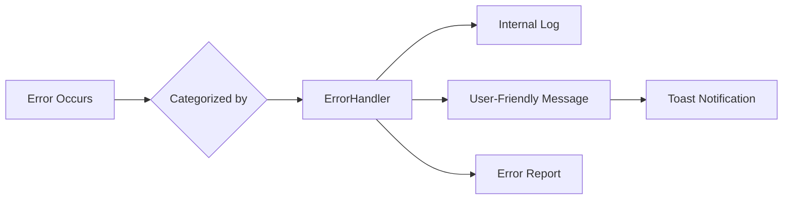

### 17.3 Promise Error Handling

All promise chains in the application have `.catch()` handlers:
- `HistoryManager` CRUD operations → catch returns `{ success: false }`
- `HistoryUI` refresh → catch shows error toast
- `app.js` history operations → catch prevents unhandled rejection
- AI operations → catch returns classified error message

---

## 18. State Management

### 18.1 State Locations

| State | Location | Module | Scope |
|-------|----------|--------|-------|
| Recording state | `isRecording` variable | SpeechManager | Module-private |
| Recognition status | `recognitionStatus` variable | SpeechManager | Module-private |
| Transcription mode | `mode` variable | TranscriptionEngine | Module-private |
| History cache | `cache` array | HistoryManager | Module-private |
| Current transcript ID | `currentTranscriptId` | HistoryManager | Module-private |
| Settings | `settings` object | SettingsManager | Module-private |
| Current theme | `currentTheme` variable | ThemeManager | Module-private |
| Upload state | `state` object | AudioUploadManager | Module-private |
| Player state | `isPlaying`, `audio` | AudioPlayerManager | Module-private |
| AI busy state | `state.isProcessing` | AIService instance | Instance-private |
| Error log | `log` array | ErrorHandler | Module-private |
| All DOM refs | `elements` object | app.js | IIFE-private |

### 18.2 State Flow Pattern

All state is module-private. Modules communicate through:
1. **Callbacks** — passed via `init(config)` (e.g., `onResult`, `onStateChange`)
2. **Return values** — synchronous getters (e.g., `getState()`, `getMode()`)
3. **Method calls** — explicit API calls (e.g., `setTheme()`, `setCurrentId()`)

There is **no global event bus**, **no shared state object**, and **no reactive state system**. State management is intentionally simple and imperative.

---

## 19. Event Flow

### 19.1 DOM Events (handled by app.js)

| Event | Target | Handler |
|-------|--------|---------|
| `click` | Mic button | Toggle recording |
| `click` | Theme toggle | Toggle theme |
| `click` | Copy/Print/Download/Share buttons | Export actions |
| `click` | New/Reset buttons | Reset workspace |
| `click` | Search prev/next/clear | Navigate search |
| `input` | Textarea (debounced 300ms) | Auto-save |
| `input` | Textarea (debounced 150ms) | Update word count |
| `input` | Search input (debounced 150ms) | Execute search |
| `keydown` | Search input | Enter/Escape handling |
| `keydown` | Mic button | Space/Enter toggle |
| `beforeunload` | Window | Cleanup resources |

### 19.2 DOM Events (handled by UI modules)

| Event | Target | Handler | Module |
|-------|--------|---------|--------|
| `click` | History button | Open panel | HistoryUI |
| `click` | History overlay/close | Close panel | HistoryUI |
| `keydown` | Document (Escape) | Close panel | HistoryUI |
| `click` | Settings button | Open modal | SettingsUI |
| `click` | Settings close/overlay | Close modal | SettingsUI |
| `keydown` | Document (Escape) | Close modal | SettingsUI |
| `change` | Theme/language/autosave | Update settings | SettingsUI |
| `click` | AI action buttons | Trigger AI | AIUI |
| `click` | AI apply/copy/close | Handle result | AIUI |

### 19.3 Custom Events

| Event | Dispatched By | Listened By | Purpose |
|-------|--------------|-------------|---------|
| `aiApiKeySet` | app.js | app.js | Reinitialize AI services after key change |

### 19.4 Browser Events

| Event | Module | Purpose |
|-------|--------|---------|
| `online` | PwaManager | Hide offline banner |
| `offline` | PwaManager | Show offline banner |
| `controllerchange` | PwaManager | Detect SW update |
| `beforeunload` | AudioManager, app.js | Cleanup resources |

---

## 20. Performance Strategy

### 20.1 Current Optimizations

| Strategy | Implementation | Impact |
|----------|---------------|--------|
| AudioContext reuse | Created once, resumed on start | Eliminates WebAudio churn |
| Debounced handlers | Textarea (300ms), search (150ms) | Reduces DOM operations |
| Cache-first SW | App shell served from cache | Instant load after first visit |
| Object URL revocation | Revoked on page unload | Prevents memory leaks |
| CSS containment | `contain: layout style` on glass-card | Reduces layout recalculation |
| CSS will-change | On animated panels | Compositor-layer promotion |
| Promise .catch() | All chains handled | Prevents silent failures |
| Stale callback guards | Upload + Player | Prevents post-clear updates |

### 20.2 Performance Budget

| Metric | Target | Current |
|--------|--------|---------|
| JS bundle (uncompressed) | < 50 KB | ~4,309 lines (~120 KB) |
| CSS (uncompressed) | < 30 KB | ~2,241 lines (~65 KB) |
| HTML | < 10 KB | ~470 lines (~15 KB) |
| Total first-load | < 200 KB | ~200 KB |
| Time to Interactive | < 2s | ~1s (cache-first) |

### 20.3 Known Performance Risks

1. **No code splitting** — all 22 JS modules loaded upfront
2. **No minification** — source served as-is
3. **Google Fonts** — external dependency, potential FOUT
4. **Canvas animation** — continuous redraw during recording
5. **Large transcripts** — textarea handling may slow with 10,000+ words

---

## 21. Future Cloud Evolution

This section documents the planned evolution path. **Nothing described here is implemented.**

### 21.1 Evolution Phases

| Phase | Version | Focus | Key Additions |
|-------|---------|-------|---------------|
| Foundation | v2.0-alpha | Backend API | Node.js, PostgreSQL, auth |
| Cloud Sync | v2.0-beta | Cross-device | Cloud storage, conflict resolution |
| AI Platform | v2.1 | Server-side AI | Whisper API, AI pipeline, BullMQ |
| Collaboration | v3.0 | Multi-user | Sharing, teams, enterprise |

### 21.2 Planned Technology Additions

| Component | Technology | Purpose |
|-----------|-----------|---------|
| Backend | Node.js/TypeScript | API server |
| Database | PostgreSQL | Transcript storage, full-text search |
| Cache | Redis | Sessions, rate limiting, queues |
| Storage | S3-compatible | Audio file storage |
| Queue | BullMQ | Async AI processing |
| Auth | JWT + OAuth | User authentication |
| Deployment | Docker + Cloud Run | Containerized hosting |

### 21.3 Frontend Strategy

The current vanilla JS frontend will **not** be rewritten. Cloud features will be added through new modules:
- `cloud-sync.js` — API communication
- `auth.js` — Login/session management
- `realtime.js` — WebSocket for live updates

Framework migration (React/Vue/Svelte) will only be considered if the component count exceeds 50+.

---

## 22. Architecture Decision Summary

| Decision | Choice | Rationale |
|----------|--------|-----------|
| Module pattern | IIFE singletons + Factory | Zero build step, clear public APIs |
| Module hierarchy | Flat (except ai/) | Simple navigation, no barrel files |
| State management | Module-private variables | Simple, predictable, no overhead |
| Inter-module communication | Callbacks via init(config) | Explicit dependencies, no event bus |
| Storage | IndexedDB + localStorage + sessionStorage | Right tool for each data type |
| UI framework | None (vanilla DOM) | Zero dependencies, full control |
| CSS approach | Custom properties + BEM-ish | Maintainable, themeable, no preprocessor |
| Build tools | None | Deploy by copying files |
| Testing | None (current) | Needs adoption before cloud work |
| TypeScript | None (current) | Needs adoption before cloud work |
| AI architecture | Factory + Provider adapters | Pluggable, swappable providers |
| PWA strategy | Cache-first app shell | Offline-friendly, fast repeat loads |
| Error handling | Centralized ErrorHandler | Consistent, categorized, user-friendly |
| Security | sessionStorage for secrets | Ephemeral, clears on tab close |

---

## 23. Known Constraints

### 23.1 Browser Requirements

- **Chrome 33+** or **Edge 79+** (Web Speech API)
- **Firefox:** Not supported (no Web Speech API)
- **Safari:** Not supported (no Web Speech API)
- **Internet connection:** Required for Web Speech API (Google servers)

### 23.2 Language Support

- **Amharic (am-ET):** Full support
- **Other languages:** Not supported for speech recognition
- **AI translation:** Supports Amharic, English, Oromo, Tigrinya, Arabic, French

### 23.3 Storage Limitations

- **IndexedDB:** Browser-dependent quota (typically 50% of disk space)
- **localStorage:** 5 MB limit per origin
- **sessionStorage:** 5 MB limit per tab
- **Audio files:** Not persisted (Object URLs are session-only)

### 23.4 Feature Limitations

- **File transcription:** Experimental (speaker-to-mic approach, requires headphones)
- **Collaboration:** Not supported (single-user only)
- **Offline AI:** Not supported (AI requires network)
- **Multi-language STT:** Not supported (Amharic only)

### 23.5 Technical Limitations

- **No type safety** — runtime errors possible from type mismatches
- **No tests** — regressions possible from changes
- **No CI/CD** — no automated quality gates
- **No code splitting** — all modules loaded upfront
- **No minification** — larger transfer size than necessary

---

## 24. Extension Guidelines

### 24.1 Adding a New Module

1. Create `js/new-module.js` as an IIFE singleton
2. Follow the pattern: `var NewModule = (function() { ... return { init, ... }; })();`
3. Accept configuration via `init(config)` with element refs and callbacks
4. Expose a minimal public API (methods users of the module need)
5. Add `<script>` tag to `index.html` (before app.js)
6. Add path to `service-worker.js` APP_SHELL array
7. If module depends on other modules, receive them via `init(config)`, not globals

### 24.2 Adding a New AI Provider

1. Create an adapter object with `buildRequest(config, prompt)` and `parseResponse(data)` methods
2. Register via `AIService.registerProvider(name, adapter)`
3. No changes needed to AISummarizer, AITranslator, or AIAnalyzer

### 24.3 Adding a New AI Capability

1. Create a new factory module (e.g., `js/ai/extractor.js`)
2. Follow the AISummarizer pattern: `create({ aiService, promptManager })`
3. Add prompt templates to `PromptManager`
4. Add UI elements to `index.html`
5. Wire in `app.js` `initAIFeatures()`

### 24.4 Adding a New Storage Backend

1. Extend `StorageManager` with new methods (e.g., `cloudCreateTranscript()`)
2. Keep IndexedDB as fallback
3. Update `HistoryManager` to use new methods when available
4. No changes needed to HistoryUI (it only uses HistoryManager)

### 24.5 Module API Contract

Every module should:
- Be an IIFE returning a public API object
- Accept configuration via `init(config)` — never hardcode DOM refs
- Never access other modules' private state
- Never modify DOM elements it doesn't own
- Provide error handling for all async operations
- Use `textContent` instead of `innerHTML` for user-provided data

---

*This document is the single source of truth for VoiceText architecture. All architectural decisions, module designs, and system behaviors are described here. For product vision and roadmap, see `ROADMAP.md`. For coding standards, see `CODING_STANDARDS.md`. For current development status, see `DEVELOPMENT_STATUS.md`.*
